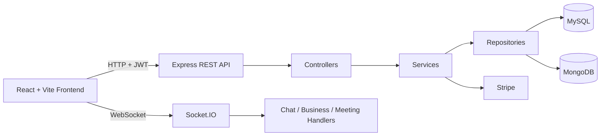

# Freelancer Marketplace

**A full-featured freelance platform** built with modern technologies. Clients post projects and hire talent, freelancers discover work and deliver through structured contracts & milestones, and administrators have powerful tools for catalog management, data import/export, reporting, auditing, and moderation.

[](https://nodejs.org/)
[](https://react.dev/)
[](https://expressjs.com/)
[](https://www.mysql.com/)
[](https://www.mongodb.com/)
[](https://socket.io/)
[](https://stripe.com/)

## Highlights

- **Role-based experience** — Distinct powerful UIs and capabilities for Clients, Freelancers, and SysAdmins.
- **Real contracts & delivery** — Proposals → Contracts → Milestones with payments, reviews, and disputes.
- **Dual-database architecture** — MySQL for transactional data + MongoDB for high-volume activity feeds.
- **Real-time everything** — Chat, presence, proposal/contract/milestone notifications via Socket.IO.
- **Advanced admin tooling** — Full CRUD on catalog, bulk CSV/JSON import, Excel/CSV export, saved reports, audit logs.
- **Payments** — Stripe integration with payment intents, milestone holds, refunds, and webhooks.
- **Modern patterns** — Layered architecture, Zod validation, CQRS (for contract workspace), JWT + HttpOnly refresh tokens + CSRF.

---

## Table of Contents

- [Quick Start](#quick-start)
- [Prerequisites](#prerequisites)
- [Features](#features)
- [Tech Stack](#tech-stack)
- [Architecture](#architecture)
- [Database Overview](#database-overview)
- [Project Structure](#project-structure)
- [API Documentation](#api-documentation)
- [Authentication & Roles](#authentication--roles)
- [Realtime & WebSockets](#realtime--websockets)
- [Security](#security)
- [Environment Variables](#environment-variables)
- [Development](#development)
- [Testing](#testing)
- [Deployment](#deployment)
- [Troubleshooting](#troubleshooting)
- [Screenshots](#screenshots)
- [Contributing](#contributing)

## Quick Start

```bash
# 1. Install everything
npm run install:all

# 2. Setup environment files
# (Unix / Git Bash / WSL)
cp backend/.env.example backend/.env
cp frontend/.env.example frontend/.env

# (PowerShell / Windows)
Copy-Item backend/.env.example backend/.env
Copy-Item frontend/.env.example frontend/.env
```

```bash
# 3. (Optional but recommended) Load the database schema
mysql -u root -p < backend/src/config/schema.sql

# 4. Run both apps
npm run dev
```

- **Frontend**: http://localhost:5173
- **Backend**:  http://localhost:3000
- **Health check**: http://localhost:3000/health

Edit `backend/.env` with your MySQL + MongoDB credentials before running `npm run dev`.

## Prerequisites

- Node.js 18+
- MySQL 8+
- MongoDB 7+
- (Optional but recommended for payments) Stripe account + test keys
- A modern terminal (PowerShell, bash, zsh, etc.)

## Features

### Public
- Dynamic landing page
- Public categories and published testimonials
- Freelancer public profiles + review stats
- Registration, login, forgot/reset password

### Clients (Role 2)
- Create and manage projects (skills, category, budget, experience level, max freelancers)
- Review proposals and accept/reject applications
- Create contracts, sign them, raise disputes
- Define and manage milestones
- Leave reviews and create testimonials
- Bookmark projects with folders, priority, and notes
- Stripe payments (intents, confirm, refund)
- Full notifications
- Profile management with photo upload
- Read-only access to contract workspace

### Freelancers (Role 3)
- Advanced project browser with filters
- Submit/edit/withdraw proposals (with bid + cover letter)
- Sign contracts and manage delivery
- Rich milestone system (create, update status, overdue/upcoming views)
- Leave and manage reviews
- Real-time activity feed (MongoDB)
- Payment history
- Manage skills (with level + years of experience)
- Full contract workspace (todos + rich sections: notes, checklists, progress bars, links)
- Saved projects with bulk actions

### Administrators (Role 1)
- User management + admin user creation
- Complete category & skill catalog management (tree view, drag order, CRUD)
- Project oversight and direct creation
- View & moderate applications, contracts, payments, milestones, reviews, disputes, testimonials
- Platform-wide settings (name, commission rate, headlines, registration toggle…)
- Audit logs + bulk cleanup
- Advanced reporting + saved custom reports (with snapshot + rerun)
- Powerful import (projects, users, applications, contracts, freelancers) via CSV/JSON
- Export everything to CSV/Excel

### Platform-Wide
- Global search (projects, freelancers, users, applications, contracts — permission-aware)
- Real-time chat (project + direct) with read receipts and presence
- Real-time business events (proposals, contracts, milestones, reviews…)
- File uploads (avatars, proposal attachments, milestone attachments)
- Account lockout on repeated failed logins
- Full CSRF + rate limiting + Helmet protection

## Tech Stack

**Frontend**
- React 19 + Vite
- React Router 7, Tailwind CSS 4
- Socket.IO Client, Stripe.js, Recharts

**Backend**
- Node.js (ESM) + Express 5
- MySQL (mysql2) + MongoDB (Mongoose)
- Socket.IO, Zod, Stripe, exceljs, csv-parse, multer, nodemailer
- bcryptjs + jsonwebtoken + cookie-parser
- Security: Helmet, CORS, rate-limit, CSRF

**Architecture**
- Classic layered (Routes → Controllers → Services → Repositories)
- CQRS for the contract workspace feature
- Auth middleware that re-validates user + role + tokenVersion on every request

## Architecture



## Database Overview

**MySQL** (primary data)
- Users, Roles, Profiles, RefreshTokens, EmailTokens, AuditLogs, Settings, Files
- Projects, Proposals, Contracts, Milestones, Payments, Disputes
- Reviews, Testimonials, Notifications, Conversations, Messages
- Categories, Skills, ProjectSkills, FreelancerSkills, SavedProjects, SavedReports

**MongoDB**
- Activity feed (freelancer side)
- Freelancer-specific notifications

The complete schema (with seeds) is in `backend/src/config/schema.sql`.

## Project Structure

```
Freelancer-MarketPlace/
├── README.md
├── package.json                 # Root scripts (concurrently dev, install:all)
│
├── backend/
│   ├── package.json
│   ├── .env.example
│   └── src/
│       ├── server.js            # Bootstrap (MySQL + Mongo + Socket + graceful shutdown)
│       ├── app.js               # Express setup, middleware stack, route mounting
│       ├── config/
│       │   ├── db.js            # MySQL connection pool
│       │   ├── mongodb.js
│       │   └── schema.sql       # Authoritative DB schema + seeds
│       ├── controllers/         # Thin handlers (validation already done)
│       ├── services/            # Business logic
│       ├── repositories/        # Data access layer
│       ├── routes/              # All route definitions + middleware wiring
│       ├── middleware/          # auth, validateRequest (Zod), rateLimit, csrf, cors, security
│       ├── validation/          # Zod schemas + password rules
│       ├── socket/              # Socket.IO server + handlers + auth middleware
│       ├── cqrs/                # Workspace CQRS (todos + sections)
│       ├── models/              # Mongoose models
│       ├── utils/               # JWT, Stripe client, errors, status helpers
│       └── __tests__/
│
├── frontend/
│   ├── package.json
│   ├── vite.config.js
│   ├── src/
│   │   ├── api/                 # Thin API clients per domain
│   │   ├── apiServices.js       # Core authenticated fetch + token + CSRF handling
│   │   ├── components/
│   │   ├── context/             # Auth, Realtime (socket), Toast, Language
│   │   ├── pages/               # All route pages (client, freelancer, adminDashboard, public)
│   │   ├── routes/              # Role-based route guards
│   │   └── utils/
│   └── public/
│
└── node_modules/ (at root + backend + frontend)
```

**Key Layers**
- `routes/` → `controllers/` → `services/` → `repositories/`
- Workspace feature uses a separate CQRS bus (commands for mutations, queries for reads)
- Realtime is handled in dedicated socket handlers that can call the same services

## API Documentation

**Base URL**: `http://localhost:3000`

All non-public routes require a valid JWT (via `Authorization: Bearer` header or the refresh flow).

Auth-related mutating endpoints also require a CSRF token (automatically handled by the frontend).

### Auth & Public Routes

| Method | Path                                | Auth          | Notes |
|--------|-------------------------------------|---------------|-------|
| POST   | `/api/auth/register`                | Public + CSRF | Creates user |
| POST   | `/api/auth/login`                   | Public + CSRF | Returns access token, sets HttpOnly refresh cookie |
| POST   | `/api/auth/refresh`                 | Public + CSRF | Rotates tokens |
| POST   | `/api/auth/logout`                  | Public + CSRF | Revokes refresh token |
| GET    | `/api/auth/me`                      | JWT           | Current user + roleID |
| POST   | `/api/auth/forgot-password`         | Public + CSRF | Sends reset email |
| POST   | `/api/auth/reset-password`          | Public + CSRF | Consumes reset token |
| POST   | `/api/auth/changePassword`          | JWT + CSRF    | Authenticated password change |
| GET    | `/api/auth/csrf-token`              | Public        | Required for auth mutating calls |
| GET    | `/api/public/home-data`             | Public        | Landing page data |
| GET    | `/api/public/testimonials`          | Public        | Published testimonials |
| GET    | `/api/categories/public`            | Public        | Public category list |

### Client Routes (`/api/client`) — requires Role 2

- Projects: full CRUD (`/projects`, `/projects/:id`)
- Applications: list + update status
- Contracts: list, detail, sign, create dispute
- Milestones: create (under contract), list, update status, delete
- Reviews: create for a contract
- Testimonials: full CRUD
- Notifications: full management
- Profile: get + update

### Freelancer Routes (`/api/freelancer`) — requires Role 3

- Public profile: `GET /public/:id`
- Dashboard + profile + skills
- Project discovery: `/browse-projects` (rich filtering), detail, apply
- Applications: list, update, soft-delete
- Contracts + milestones + reviews (rich set of endpoints)
- Activity feed (Mongo): `/activities`
- Payments history
- Saved projects (see dedicated section below)
- Notifications

### Admin Routes (`/api/admin`) — requires Role 1

Full management of users, categories, skills, projects, disputes, payments, applications, contracts, audit logs, testimonials, reviews, milestones, notifications, platform settings, saved reports, etc.

### Other Important Route Groups

- **`/api/chat`** — Conversations, direct chats, messages, read receipts
- **`/api/saved-projects`** — Freelancer bookmarking with folders & bulk operations
- **`/api/search`** — Unified search across projects/freelancers/users/applications/contracts (results filtered by actor)
- **`/api/export`** — CSV/Excel exports (some admin-only)
- **`/api/import`** — CSV/JSON bulk import (multipart `file` field)
- **`/api/reports`** — Platform summary, per-user reports, saved dynamic reports + run history
- **`/api/payment`** — Stripe intents, confirm, refund, history
- **`/api/reviews`** — Public + private review endpoints
- **`/api/contracts/:id/workspace`** — CQRS-powered collaborative workspace (todos + sections)
- **`/health`** — MySQL + Mongo status

**Request validation**: Every route that accepts body/params/query uses Zod schemas defined in `backend/src/validation/schemas.js`.

### API Usage Examples

**Login (with CSRF)**

```bash
# First get CSRF token
curl -c cookies.txt http://localhost:3000/api/auth/csrf-token

# Then login
curl -b cookies.txt -c cookies.txt -X POST http://localhost:3000/api/auth/login \
  -H "Content-Type: application/json" \
  -H "X-CSRF-Token: <token-from-above>" \
  -d '{"email":"user@example.com","password":"StrongPass123!"}'
```

**Client creates a project**

```bash
curl -X POST http://localhost:3000/api/client/projects \
  -H "Authorization: Bearer <ACCESS_TOKEN>" \
  -H "Content-Type: application/json" \
  -d '{
    "title": "Build a modern landing page",
    "pDesc": "We need a fast, accessible marketing site...",
    "budget": 1200,
    "deadline": "2025-12-15",
    "categoryID": 3,
    "experienceLevel": "intermediate",
    "maxFreelancers": 1
  }'
```

**Freelancer applies to a project**

```bash
curl -X POST http://localhost:3000/api/freelancer/projects/42/apply \
  -H "Authorization: Bearer <ACCESS_TOKEN>" \
  -H "Content-Type: application/json" \
  -d '{
    "coverLetter": "I have 6 years of React experience...",
    "bidAmount": 950,
    "estimatedDays": 12
  }'
```

## Authentication & Roles

| Role ID | Name      | Description                        |
|---------|-----------|------------------------------------|
| 1       | SysAdmin  | Full platform control              |
| 2       | Client    | Can post projects and hire         |
| 3       | Freelancer| Can apply and deliver work         |

- Short-lived JWT access tokens
- HttpOnly refresh token cookies (7 days by default)
- `tokenVersion` on the user row allows instant global logout on password change or security events
- Every protected request re-validates the user + role from the database

## Realtime & WebSockets

- Endpoint: `/socket.io`
- Token-based authentication (same access token)
- User is joined to `user:<id>` room
- Events cover chat, proposal/contract/milestone lifecycle, review creation, presence (`presence:online` / `presence:offline`), and notification badges.

The frontend `RealtimeContext` handles connection and event distribution.

## Security

- Helmet + strict CORS (configurable via `ALLOWED_ORIGINS`)
- Rate limiting on login/register/refresh + global API limiter
- CSRF protection on all state-changing auth endpoints
- Account lockout after repeated failures
- Strong password rules (via Zod + custom validator)
- All SQL queries use prepared statements
- Refresh tokens are hashed and revocable
- Stripe webhooks receive raw body

## Environment Variables

**Backend** (`backend/.env`)

Create from the example:
```bash
cp backend/.env.example backend/.env     # Unix / Git Bash
Copy-Item backend/.env.example backend/.env   # PowerShell
```

Key variables:
- Database connection (`DB_HOST`, `DB_USER`, `DB_PASSWORD`, `DB_NAME`)
- JWT settings (`JWT_SECRET` — use a strong 32+ char value, `JWT_ISSUER`, `JWT_AUDIENCE`, `REFRESH_TOKEN_DAYS`)
- `MONGO_URI`
- `ALLOWED_ORIGINS`
- SMTP settings (for password reset emails)
- Stripe: `STRIPE_SECRET_KEY` + `STRIPE_WEBHOOK_SECRET`

**Frontend** (`frontend/.env`)

Create from the example:
```bash
cp frontend/.env.example frontend/.env
# or
Copy-Item frontend/.env.example frontend/.env
```

Required variables:
- `VITE_API_BASE=http://localhost:3000`
- `VITE_STRIPE_PUBLISHABLE_KEY=pk_test_...` (for Stripe Elements)

## Development

### Getting Started (Detailed)

1. Install dependencies:
   ```bash
   npm run install:all
   ```

2. Create environment files:

   **Unix / Git Bash / WSL**
   ```bash
   cp backend/.env.example backend/.env
   cp frontend/.env.example frontend/.env
   ```

   **PowerShell (Windows)**
   ```powershell
   Copy-Item backend/.env.example backend/.env
   Copy-Item frontend/.env.example frontend/.env
   ```

3. Edit `backend/.env` and set your MySQL and MongoDB connection details.

4. (Strongly recommended) Initialize the database schema:
   ```bash
   mysql -u root -p < backend/src/config/schema.sql
   ```

5. Start both applications:
   ```bash
   npm run dev
   ```

### Available Scripts

**Root level**
- `npm run dev` — Both apps with concurrently
- `npm run install:all`

**Backend** (`cd backend`)
- `npm run dev` — `node --watch`
- `npm start`
- `npm test`

**Frontend** (`cd frontend`)
- `npm run dev`
- `npm run build`
- `npm run preview`
- `npm run lint`

## Testing

- Backend tests: `cd backend && npm test` (Vitest)
- Currently covers JWT utilities, validation schemas, and account lockout logic.
- Frontend: `npm run lint`

## Deployment

1. Set strong production secrets and `NODE_ENV=production`.
2. Build the frontend: `cd frontend && npm run build`.
3. Serve the `dist` folder statically (or deploy to Vercel/Netlify) and point it at your backend API.
4. Run the backend with a process manager (PM2, Docker, systemd, etc.).
5. Point Stripe webhooks at your production `/api/payment/webhook` endpoint.
6. Use a proper migration system for future schema changes instead of the raw `schema.sql` ALTERs.

## Troubleshooting

**"Cannot connect to MySQL"**
- Check `DB_*` values in `backend/.env`.
- Make sure the database exists and the user has privileges.
- Run the schema.sql file.

**"MongoDB connection failed"**
- The app will still start (MySQL features work). Reviews and activity feed will be degraded.
- Verify `MONGO_URI`.

**CSRF token errors on login/register**
- Make sure you're calling `/api/auth/csrf-token` first and sending the `X-CSRF-Token` header (frontend does this automatically).

**Stripe payments not working**
- Set both `STRIPE_SECRET_KEY` and `STRIPE_WEBHOOK_SECRET`.
- For local testing use Stripe CLI to forward webhooks.

**Port already in use**
- Change `PORT` in backend `.env` or kill the process on 3000/5173.

**Uploads not showing**
- The backend serves files from `src/uploads` at `/uploads`.

**Tests failing on lockout**
- The test expects 5 attempts, but the default in non-production is 10. Set `AUTH_LOCKOUT_MAX_ATTEMPTS=5` or run with `NODE_ENV=production`.

## Screenshots

Create a `docs/screenshots/` folder and add images for:

- Landing page
- Client dashboard + post project
- Freelancer browse + workspace
- Admin catalog, reports, import/export, disputes

## Contributing

1. Fork the repository
2. Create a feature branch
3. Make your changes (follow existing patterns: controller → service → repository)
4. Add/update tests where appropriate
5. Run `npm run lint` (frontend) and backend tests
6. Open a Pull Request

Please keep the layered architecture and Zod validation consistent.

## License

This project is provided as-is for educational and production use. Feel free to use and modify it.

---

**Need help?** Start the servers and visit `/health`. Check the console logs and `.env` configuration first.

Built with love for realistic full-stack freelance platform patterns.
