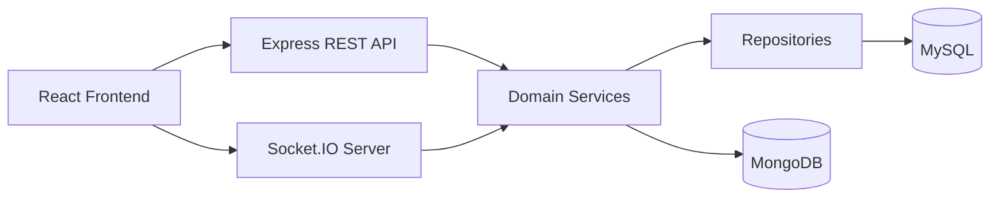
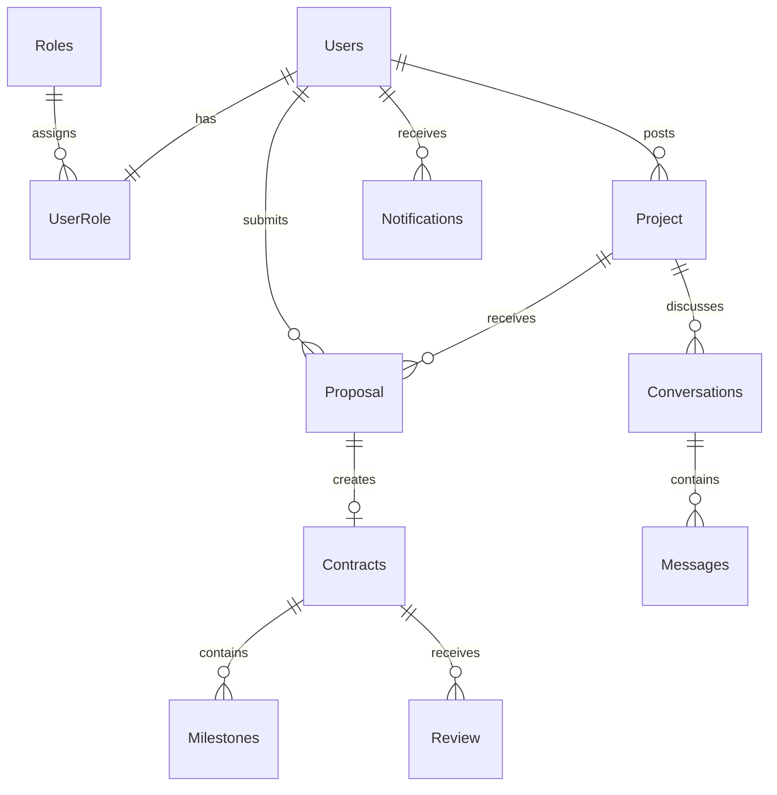

# Freelancer Marketplace

Freelancer Marketplace is a full-stack web application for clients, freelancers, and administrators. Clients can post projects, freelancers can apply and manage contracts, and administrators can manage users, catalog data, reports, imports, exports, and platform notifications.

## Architecture

- Frontend: React, Vite, React Router, Tailwind CSS, Socket.IO client.
- Backend: Node.js, Express, Socket.IO, MySQL, MongoDB.
- SQL data: users, roles, projects, proposals, contracts, milestones, reviews, conversations, messages, saved projects, notifications.
- MongoDB data: freelancer activity feed and freelancer-specific notifications.
- Backend structure follows controller -> service -> repository boundaries.



## ER Diagram



## Setup

1. Install dependencies:

```bash
npm run install:all
```

2. Create environment files:

```bash
cp backend/.env.example backend/.env
cp frontend/.env.example frontend/.env
```

3. Configure MySQL and MongoDB in `backend/.env`.

4. Start both apps:

```bash
npm run dev
```

Default URLs:

- Frontend: `http://localhost:5173`
- Backend: `http://localhost:3000`

## API Endpoints

Core groups:

- `POST /api/auth/register`
- `POST /api/auth/login`
- `POST /api/auth/refresh`
- `POST /api/auth/logout`
- `GET /api/auth/me`
- `GET /api/client/projects`
- `GET /api/freelancer/browse-projects`
- `POST /api/freelancer/projects/:projectId/apply`
- `PATCH /api/client/applications/:applicationId/status`
- `GET /api/chat/conversations`
- `GET /api/reports/platform-summary`
- `GET /api/export/:resource`
- `POST /api/import/projects`

## Realtime

Socket.IO is used for chat, presence, business notifications, proposal updates, contract creation, milestone updates, reviews, and notification badges. Socket authentication uses the access token and revalidates the active user, role, and token version.

## Security Notes

- Refresh tokens are issued as HttpOnly cookies.
- Access tokens include a token version.
- Auth middleware revalidates active user and role from MySQL.
- Project import is restricted to admins and clients.
- Import files are limited to CSV/JSON with a 2MB limit.

## Testing

Backend tests:

```bash
cd backend
npm test
```

Frontend lint:

```bash
cd frontend
npm run lint
```

## Deployment Guide

1. Provision MySQL and MongoDB.
2. Set production env vars: `JWT_SECRET`, `DB_*`, `MONGO_URI`, `ALLOWED_ORIGINS`, `NODE_ENV=production`.
3. Build the frontend:

```bash
cd frontend
npm run build
```

4. Run backend with a process manager or container:

```bash
cd backend
npm start
```

For production, move schema changes to versioned migrations before deploying.

## Screenshots

Add production screenshots under `docs/screenshots/`:

- Landing page
- Client dashboard
- Freelancer dashboard
- Admin dashboard
- Chat
- Contracts and milestones
